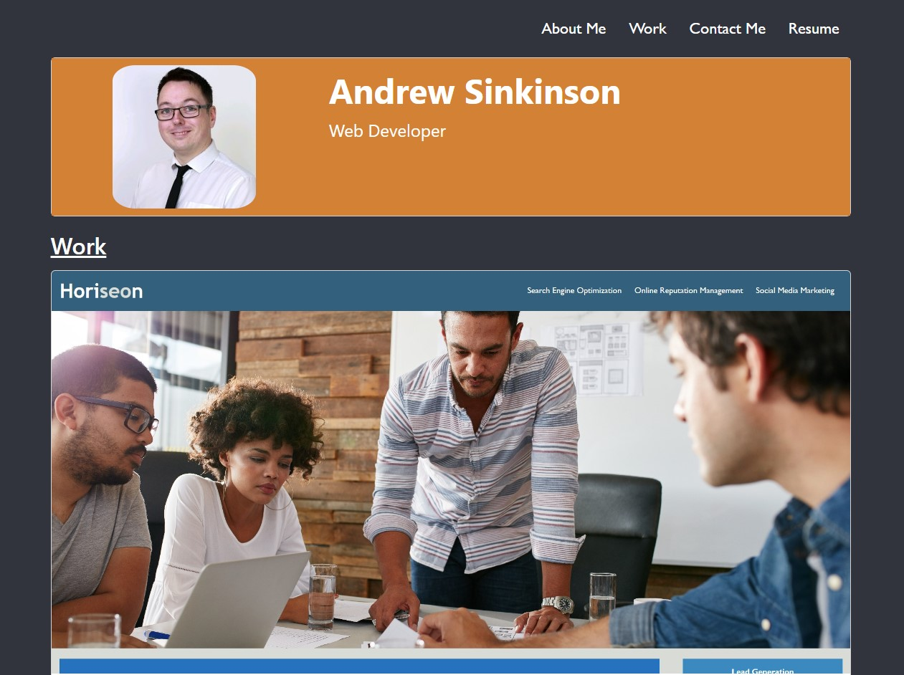

# Bootstrap-Portfolio

## Description

The aim of this project is to set up a Portfolio page using Bootstrap to showcase my work; viewable on both desktop and mobile devices.

The website can be viewed [here](https://duouk2000.github.io/Bootstrap-Portfolio/)

## Installation

NA

## Usage

The website first contains a nav bar menu from which you can select where on the website you wish to quickly jump to. It also contains my resume. Scroll down to see my name, photograph and work selection. Below that is a list of skills I have so far learnt as well as an 'About Me' section and contact information links. 

My Twitter and Spotify are in the footer along with a button that takes you to the top of the page. 

All links and the button have a hover effect on them that turns the text aqua coloured when the mouse hovers over it. The button also has a pink box-shadow effect that appears when the mouse hovers over it.

## Screenshot

    
## Credits

- Websites used to review and test HTML and CSS - [w3schools](https://www.w3schools.com/html/default.asp) /
[MDN Web Docs](https://developer.mozilla.org/en-US/docs/Learn/HTML)

- Websites reviewed to help generate a badge - [Shields.io](https://shields.io/badges) & [lukas-h github](https://gist.github.com/lukas-h/2a5d00690736b4c3a7ba)

- Meg Meyers for tutoring me and helping with my questions regarding buttons which were displaying odd visual behaviours.

- Website used for reviewing and testing out bootsrap code - [Bootstrap](https://getbootstrap.com/docs/5.3/getting-started/introduction/)

## License

MIT License

Copyright (c) 2023 Andrew Sinkinson

Permission is hereby granted, free of charge, to any person obtaining a copy of this software and associated documentation files (the “Software”), to deal in the Software without restriction, including without limitation the rights to use, copy, modify, merge, publish, distribute, sublicense, and/or sell copies of the Software, and to permit persons to whom the Software is furnished to do so, subject to the following conditions:

The above copyright notice and this permission notice shall be included in all copies or substantial portions of the Software.

THE SOFTWARE IS PROVIDED “AS IS”, WITHOUT WARRANTY OF ANY KIND, EXPRESS OR IMPLIED, INCLUDING BUT NOT LIMITED TO THE WARRANTIES OF MERCHANTABILITY, FITNESS FOR A PARTICULAR PURPOSE AND NONINFRINGEMENT. IN NO EVENT SHALL THE AUTHORS OR COPYRIGHT HOLDERS BE LIABLE FOR ANY CLAIM, DAMAGES OR OTHER LIABILITY, WHETHER IN AN ACTION OF CONTRACT, TORT OR OTHERWISE, ARISING FROM, OUT OF OR IN CONNECTION WITH THE SOFTWARE OR THE USE OR OTHER DEALINGS IN THE SOFTWARE.

## Badges

